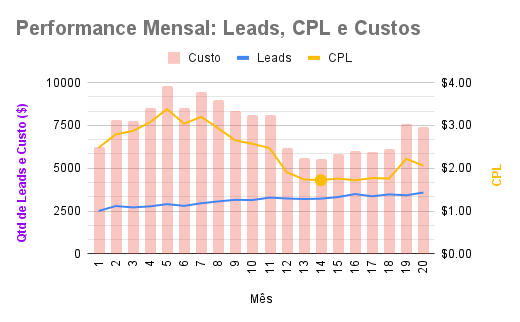

# marketing_campaign_assessment

# 1. Problema de Negócio

A empresa “Sales Machine” é uma empresa que fornece um ecossistema de e-commerce para empreendedores que querem criar sua loja online, incluindo a loja online propriamente, sistema de pagamentos, logística e etc. Alguns concorrentes diretos são VTEX, Loja Integrada e Nuvemshop.

Cenário: o time de Marketing da Sales Machine solicita então ajuda para melhorar a aquisição de clientes e fazer otimizações do investimento, além de pedir opinião sobre a performance nos últimos 20 meses.

Dado esse contexto e a partir dos dados disponíveis, irei definir os KPIs e em seguida avaliarei a performance durante o período.

Por fim, darei uma recomendação de estratégia para melhorar a performance dos times com base nestes KPIs.

# 2. Overview sobre os Dados

Para o essa análise foi utilizado 2 datasets disponíveis chamados de “Trials” e “Costs”. “Trials” tem uma lista de todas as lojas de prova (trials) que foram geradas nos últimos 20 meses (Leads). “Costs” tem os custos de Marketing por canal para adquirir esses trials (leads).

Definições dos Datasets:
- Source: canal de aquisição do trial.
- Device: dispositivo de criação da loja (Mobile ou Desktop).
- Payment Probability: a probabilidade de que um trial se torne um pagamento. Se o valor for maior ou igual que 0.75, significa que com certeza que a loja se tornará cliente (conversão).

# 3. Considerações, premissas e observações sobre os dados e a resolução

- Como só há disponíveis dados dos custos das campanhas (sem salário dos profissionais envolvidos, infraestrutura necessária e etc), não utilizarei o CAC, utilizarei o CPA para mensurar conversões.
- Considero também que para ter uma visão mais completa da performance das campanhas seria necessário ter dados para calcular o ROI e LTV.
- Não explorei muito a variável device por não considerar relevante para extração de insights acionáveis nesse contexto.

# 4. Solução (Pt 1): Definição dos KPIs para avaliação da performance

Farei a avaliação da performance de forma geral e por canal também, que considero mais útil.

Para a avaliação utilizarei os KPIs abaixo.

Desempenho geral:
- Lead / device / mês
- Cliente / device / mês
- Taxa de conversão / device / mês
- Leads / mês
- Clientes / mês
- Taxa de conversão / mês
- CPL / mês
- CPA / mês
- Custo / mês

Desempenho por canal:
- Leads / canal / mês
- Clientes / canal / mês
- Taxa de conversão / canal / mês
- CPL / canal / mês
- CPA / canal / mês
- Custo / canal / mês

# 5. Solução (Pt 2): Avaliação da performance por meio dos KPIs

**5.1 Performance por Device (Leads, Clientes e Taxa de Conversão)**

Conforme os gráficos nº 1 e 2 abaixo,  a respeito do Device, analisando a performance sem quebrar por canal, nota-se que ambos dispositivos apresentaram tendência de crescimento dos leads mensais, mas se tratando de clientes, o Desktop apresentou tendência de crescimento mais significativa se comparado ao Mobile, que devido às proporções do gráfico aparenta estagnação, mas observando os número notamos tendência de crescimento sutil.

### Gráfico 1

### Gráfico 2

Além disso, ao analisar o gráfico nº 3 abaixo, referente a performance de conversão (leads/clientes) por device, ambos dispositivos aparentam quase uma estagnação, mas nota-se sutil tendência de queda do Desktop e sutil tendência de alta do Mobile.

### Gráfico 3

## Performance Geral (Leads, CPL e Custos)

Conforme o gráfico nº 4 abaixo, analisando a performance geral, sem quebrar por canal, notamos a tendência de crescimento de leads mensais, em contrapartida, nota-se o crescente custo até o mês 5, mas do mês 7 ao 10 nota-se diminuição nos custos, porém a quantidade de leads mantém a tendência de crescimento em todo o período, apresentando fraca correlação negativa com os custos (-41,21%), algo positivo que ajuda a reduzir o CPL. A partir do mês 13 nota-se tendência de crescimento nos custos, mas que não altera ou acentua os leads que já estavam em tendência crescente. Principalmente nos meses 19 e 20 nota-se um pico nos custos que só reflete no aumento do CPL, sem consequência no crescimento significativo equivalente dos leads. 

### Gráfico 4

Conforme as tabelas nº 1, 2 e 3 abaixo, nota-se uma performance positiva ao final do período, com CPL quase 17% menor que o mês 1, porém o mês 14 (com um círculo no gráfico)  que apresentou o período de melhor performance com CPL 30,65% menor que o mês 1. Porém, fatores como sazonalidade podem distorcer a realidade ao comparar períodos curtos e diferentes, em função disso, ao comparar o semestre do fim do período com o do início conforme a tabela, obtemos um CPL ainda melhor, de 38,20% menor que o início, reforçando a situação positiva.

### Tabela 1 - CPL, Leads e Custos

### Tabela 2 - CPL, Leads e Custos

### Tabela 3 - CPL, Leads e Custos

## Performance Geral (Clientes, CPA, Custos e Taxa de Conversão)

Conforme o gráfico nº 5 e 6 abaixo, nota-se um movimento do CPA x clientes semelhante ao visto anteriormente com o CPL x leads, referente aos períodos em que diminui o custo, mas a quantidade de clientes (antes leads) continua crescente, algo positivo que diminui o CPA. Se assemelha também o movimento no mês 19 e 20, em que o CPA (antes CPL) cresce como reflexo do aumento dos custos devido ao não crescimento significativo equivalente dos clientes (antes leads). Ao calcular a correlação entre CPL e CPA de todo o período obtemos forte correlação positiva (96,31%), validando observações anteriores, referente às movimentações semelhantes aos 2 KPIs.

### Gráfico 5

### Gráfico 6

Conforme as tabelas nº 4, 5 e 6 abaixo, nota-se uma performance positiva ao comparar mês 1 e 20, com CPA 16,21% menor que o início, porém o mês 16 (com um círculo no gráfico nº 5)  que apresentou melhor performance com CPA 34,08% menor que o início. Novamente, comparando semestres a fim de diminuir sazonalidade, obtemos também um valor melhor, com CPA do último semestre 41,27% menor que o de início.

### Tabela 4 - CPA, Clientes e Custos

### Tabela 5 - CPA, Clientes e Custos

### Tabela 6 - CPA, Clientes e Custos

Ao comparar os meses 1 e 20, a melhor performance do CPL foi no mês 14, mas a do CPA foi 16. Além disso, conforme o gráfico nº 7 abaixo, destaca-se o mês 17 com a maior conversão (12,82%) e o mês 16 com a 2º (12,71%), em que obteve-se o menor CPA.

### Gráfico 7

Dessa forma percebe-se a importância de analisar CPA junto com conversão, para entender a proporção de leads que de fato estão se tornando clientes e também o custo de aquisição desses clientes.

## Performance por Canal (Leads e Custos)

Finalizado a análise geral e agora entrando com a performance quebrada pelos canais de aquisição, conforme o gráfico nº 8 e as tabelas nº 7 e 8 abaixo, observa-se tendência de crescimento dos leads em todos canais, mas  ao comparar mês 1 e 20 destaca-se o Google Ads Brand com o maior crescimento (53,54%).

### Gráfico 8

### Tabela 7 - Leads

### Tabela 8 - Leads

Apesar disso, conforme o gráfico nº 9 e tabelas nº 9 e 10 abaixo, nota-se também que o custo ao comparar os meses 1 e 20 deste canal aumentou desproporcionalmente ao crescimento (136,61%). A partir da comparação entre semestres de início e fim do período ao invés dos meses, percebe-se mudanças significativas, o Google Ads Brand apresenta um crescimento dos leads bem inferior, agora ficando atrás do Google Ads Non Brand que apresentou 37,42% de crescimento.

### Gráfico 9

### Tabela 9 - Custo

### Tabela 10 - Custo

Um ponto de atenção também é o pico nos custos do canal Google Ads Brand no mês 5 e do Non Brand nos meses 5 e 7. Além disso, percebe-se movimento semelhante dos custos entre esses canais, apresentando uma correlação positiva moderada (57,99%).

## Performance por Canal (Leads, CPL e Custos)

Conforme o gráfico nº 10 e tabela nº 11 e 12 abaixo, ao analisar a performance do CPL durante o período, comparando os meses 1 e 20 percebe-se que nem todos canais apresentaram uma melhora (redução). Nesse caso, Facebook apresenta maior redução do CPL, mas ainda sim continua alto comparado aos demais, com exceção do Google Ads Non Brand. Destaca-se Google Ads Non Brand devido à alta expressiva seguida de queda expressiva a partir do mês 4 até o 14, mas ainda sim termina no mês 20 com CPL alto em relação a todos canais.

### Gráfico 10

### Tabela 11 - CPL

### Tabela 12 - CPL

Ao comparar os meses 1 e 20 o canal Google Ads Brand se mantém o mais atrativo, pois apesar de ter apresentado o maior crescimento (%) do CPL ao final do período, apresentou o menor CPL em número absoluto comparado aos demais canais, algo positivo. Além disso, esse mesmo canal se manteve com menor CPL predominantemente em todo período em comparação aos demais canais.

Nesse caso, a estratégia de comparação entre semestres para amenizar o impacto de sazonalidade não é interessante, pois observa-se que agora muda o cenário, com o Google Ads Non Brand com uma redução significativamente maior, inclusive superior ao Google Ads Brand, porém isso se deve principalmente aos 2 picos nos meses 4 e 7 do CPL que ocorrem de forma muito alta apenas nesse nesse canal, que estão contidos dentro do semestre considerado como de início e por fim isso gera uma distorção na comparação.

## Performance por Canal (Clientes, CPA e Custos)

Conforme o gráfico nº 11 e tabelas nº 13 e 14 abaixo, nota-se que o canal Facebook apresenta o CPA com bastante variação e números elevados durante o período, até impossibilitando a visualização da performance dos demais canais nesse gráfico. 

### Gráfico 11

### Tabela 13 - CPA

### Tabela 14 - CPA

Por essa razão, esse canal foi removido no gráfico nº 12 abaixo, assim percebe-se que o canal Google Ads Non Brand também apresenta bastante variação no período e números elevados comparados aos outros 2 canais e de novo dificulta a visualização deles.

### Gráfico 12

Agora conforme o gráfico nº 13 abaixo com somente com os canais Google Ads Brand e Partners, possibilitando melhor comparação entre eles isoladamente.

### Gráfico 13

A partir do conjunto de gráficos nº 11, 12 e 13 e tabelas nº 13 e 14 apresentados anteriormente, ao observar variação relativa e absoluta do CPA entre os meses 1 e 20, destaca-se o canal Google Ads Non Brand positivamente, por ser o único canal que apresentou redução, apesar disso, continua com CPA elevado e desvantajoso em comparação ao Google Ads Brand e Partners, mesmo que significativamente reduzido.

Observa-se novamente o destaque do canal Google Ads Brand positivamente, pois apesar de apresentar crescimento relativo elevado do CPA ao comparar os meses 1 e 20, finalizou com o menor no mês 20, além de ter apresentado predominantemente o menor ao longo do período, reflexo das variáveis custos e clientes mensais como podemos ver nos gráficos nº 9 (anterior) e 14 (abaixo).

### Gráfico 14

Nesse caso, assim como em casos explicados anteriormente, não será considerado a comparação entre semestre final e anterior, pois observa-se picos em determinados meses que não se repetem em todos os canais, isso gera distorção na comparação.

Conforme o gráfico nº 12 (acima) e as tabelas nº 15 e 16 abaixo, ao comparar os meses 1 e 20, observa-se o crescimento de clientes mensais em todos canais, o Google Ads Brand apresenta maior número de clientes em 100% do período, inclusive com um pico no mês 16, mas em termos de crescimento fica atrás de Partners (com maior crescimento) por 1.79 ponto porcentual.

### Tabela 15 - Clientes

### Tabela 16 - Clientes

Por fim, conforme o gráfico nº 15 abaixo, observa-se o canal Partner como destaque, apresentando maior taxa de conversão predominantemente em todo período, apesar de uma redução ao comparar os meses 1 e 20. Atrás de Partners se encontra o Google Ads Brand com a segunda maior taxa de conversão ao longo do tempo, apesar de sutil redução (-0,18%) ao comparar os meses 1 e 20 também.

### Gráfico 15

A partir da análise do conjunto de gráficos e tabelas apresentados anteriormente relacionado à quebra por canais, nota-se mais vantagem no canal Google Ads Brand de forma geral, pois apesar de ter apresentado taxa de conversão inferior canal Partners, apresenta o menor CPA predominante no período.

## Recomendação Final (Para melhorar performance de KPIs)

Frente a esse cenário, considero que a estratégia mais eficiente seria focar em melhorar os KPIs CPA e taxa de conversão olhando individualmente para cada canal.

Para isso, considero um caminho eficiente investigar os picos positivos e negativos para entender o que pode ter gerado e criar estratégias para tentar replicar o melhor cenário. 

Em conjunto é importante entender qual o canal possui melhor relação entre custo x retorno x conversão e fazer testes com investimentos financeiros para entender até que ponto esse canal é escalável. Após encontrar o limite (se encontrar), investir o restante do budget no 2º canal mais performático utilizando a mesma estratégia e assim por diante com o restante dos canais. Existe a possibilidade de se chegar a conclusão que faz mais sentido se concentrar apenas em alguns canais, excluindo os demais, assim como explorar e acrescentar novos canais como o Instagram e TikTok, por exemplo.

Apesar disso, é importante analisar o comportamento dos outros canais após aumentar os investimentos (custos) em um determinado canal, pois um pode impactar no outro. 

Ex: Suponhamos que o canal de Google Ads Brand Campaigns saturou, ou seja, com aumento dos investimentos só aumenta o CPA. É uma hipótese que ao aumentarmos os investimentos no canal Google Ads Non Brand Campaigns com o tempo os interessados descubram a Empresa x indiretamente, devido ao awareness gerado primeiro para o assunto de e-commerce, que por consequência pode gerar mais visibilidade para players específicos desse mercado. Esse possível acontecimento pode gerar uma nova oportunidade de otimização do canal  Google Ads Brand Campaigns que antes havia saturado. É uma hipótese que o aumento do investimento em outro canais como Facebook e Partners gerem mais visibilidade para a Empresa x também, mas dessa vez não pelo assunto e-commerce, agora de forma orgânica.

Devido ao exemplo hipotético acima observa-se a importância do constante monitoramento de todos os canais após cada ação.

Dessa forma, garante-se que o budget está sendo alocado da melhor forma, gerando o máximo de retorno possível. Por consequência dessa ação nos canais, a performance dos KPIs de forma agregada será otimizada também.

A partir da lógica acima, levando em consideração a performance analisada anteriomente, orientada principalmente pelo CPA e taxa de conversão, a ordem dos canais para alocação dos investimentos e realização dos testes que eu utilizaria seria:
1. Google Ads Brand Campaigns
2. Partners
3. Google Ads Non Brand Campaigns
4. Facebook Campaigns

